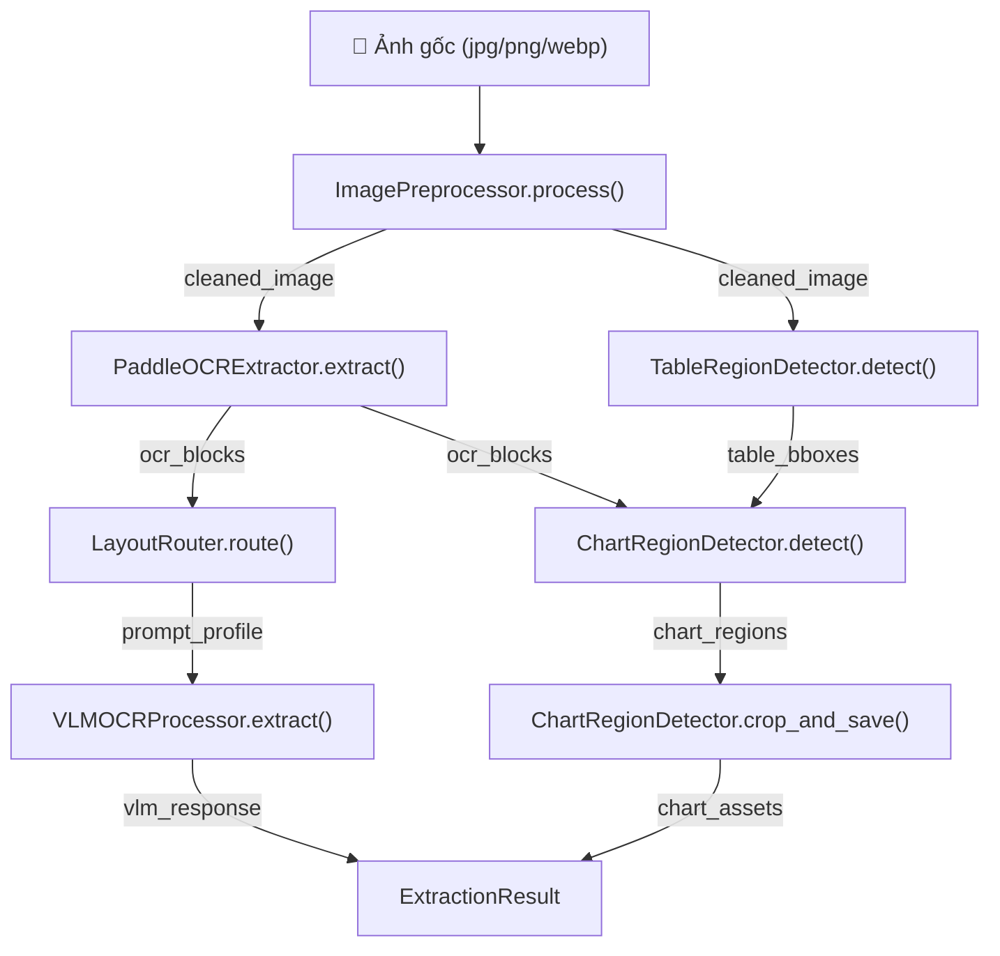
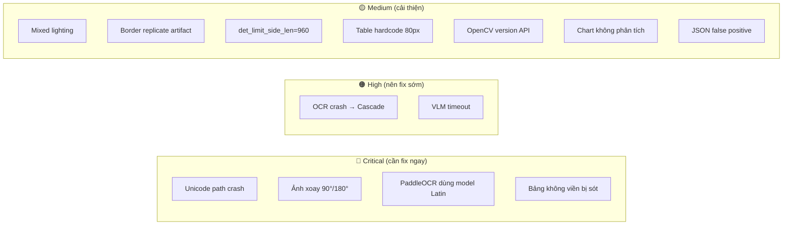

# 🔬 Phân Tích Pipeline Xử Lý Biểu Đồ — Doc Anchor AI

## Tổng quan luồng xử lý (End-to-End Flow)

## Chi tiết từng bước & Điểm gây hỏng

---

### Bước 1: Nạp & Tiền xử lý ảnh
**File:** [image_preprocessor.py](file:///d:/Project/Doc%20Anchor%20AI/src/ingestion/image_preprocessor.py)

**Luồng:**
1. `cv2.imread()` — đọc ảnh gốc
2. `enhance_brightness_if_dark()` — CLAHE cân bằng sáng nếu ảnh tối (L < 110)
3. `deskew()` — HoughLinesP xoay thẳng micro-skew (chỉ xoay nếu > 0.5°)
4. `cv2.imwrite()` — lưu ảnh đã clean

**🚨 Điểm gây hỏng pipeline:**

| # | Vấn đề | Hậu quả | Mức độ |
|---|--------|---------|--------|
| 1 | `cv2.imread()` không hỗ trợ Unicode path trên Windows | Ảnh có tên tiếng Việt (`Hợp_đồng.jpg`) sẽ trả về `None`, pipeline crash | 🔴 Critical |
| 2 | CLAHE chỉ chạy khi `avg_brightness < 110` | Ảnh có vùng sáng + vùng tối (mixed lighting, ví dụ chụp điện thoại có bóng tay) sẽ không được xử lý, PaddleOCR sót chữ ở vùng tối | 🟡 Medium |
| 3 | Deskew dùng `cv2.BORDER_REPLICATE` | Khi xoay ảnh, các góc bị replicate pixel viền, tạo ra các "sọc giả" (artifact) có thể bị ChartDetector nhận nhầm là cột biểu đồ | 🟡 Medium |
| 4 | Deskew chỉ xoay micro-skew (< 15°) | Ảnh bị xoay 90°/180° (người dùng chụp dọc/ngược) sẽ không được sửa, toàn bộ OCR sẽ đọc sai thứ tự | 🔴 Critical |

---

### Bước 2: OCR Text Extraction
**File:** [extractors/](file:///d:/Project/Doc%20Anchor%20AI/src/ingestion/extractors) → `PaddleOCRExtractor`

**Luồng:**
1. PaddleOCR(`lang='vi'`) detect text boxes
2. Trả về `list[OCRBlock]` với `text`, `confidence`, `bbox`

**🚨 Điểm gây hỏng pipeline:**

| # | Vấn đề | Hậu quả | Mức độ |
|---|--------|---------|--------|
| 5 | PaddleOCR PP-OCRv3 dùng model `latin` thay vì `ch` (Chinese+Vietnamese) | Với tiếng Việt có dấu (ă, ơ, ư, đ), model Latin recognition sẽ sai rất nhiều ký tự dấu, kéo CER/WER lên cao | 🔴 Critical |
| 6 | OCR fail → `ocr_blocks = []` → `table_regions = []` | Nếu PaddleOCR crash (OOM, GPU error), ChartDetector nhận `table_bboxes=[]` và sẽ không mask được bảng, nhận nhầm bảng thành biểu đồ (Cascade Error - Lỗi 6) | 🟠 High |
| 7 | `det_limit_side_len=960` (mặc định) | Ảnh 4K (3840px) bị resize xuống 960px trước khi detect, mất chi tiết chữ nhỏ trong bảng/biểu đồ | 🟡 Medium |

---

### Bước 3: Table Region Detection
**File:** [table_region_detection.py](file:///d:/Project/Doc%20Anchor%20AI/src/ingestion/table_region_detection.py)

**Luồng:**
1. Nhị phân hóa ảnh (adaptiveThreshold)
2. Tách đường ngang + dọc bằng morphology
3. Tính giao cắt (intersections) → ít nhất 4 giao điểm mới là bảng
4. Tìm contours → lọc diện tích → trả `list[TableRegion]`

**🚨 Điểm gây hỏng pipeline:**

| # | Vấn đề | Hậu quả | Mức độ |
|---|--------|---------|--------|
| 8 | Hardcode `bw < 80 or bh < 80` (dòng 114) | Bảng nhỏ trên ảnh 4K bị bỏ sót → ChartDetector nhận nhầm thành chart | 🟡 Medium |
| 9 | Chỉ detect bảng có đường kẻ (line-based) | Bảng không viền (borderless table, rất phổ biến trong báo cáo tài chính) bị bỏ sót hoàn toàn → Chart nhận nhầm | 🔴 Critical |
| 10 | `cv2.findContours` API khác nhau giữa OpenCV 3.x và 4.x | Dòng 131 cố xử lý cả 2 version nhưng dòng 132 lại ghi đè → code dòng 131 vô dụng, có thể crash trên OpenCV 3 | 🟡 Medium |

---

### Bước 4: Chart Region Detection (ĐÃ VIẾT LẠI v2.0)
**File:** [chart_region_detector.py](file:///d:/Project/Doc%20Anchor%20AI/src/ingestion/chart_region_detector.py)

**Luồng v2.0 (mới):**
1. Tính Dynamic Thresholds từ kích thước ảnh
2. **Pass 1 (Subtractive):** Mask bảng + Smart mask text → multi-scale morphology
3. **Pass 2 (Raw):** Không mask gì cả → multi-scale morphology  
4. **Merge:** Gộp kết quả 2 pass, loại trùng lặp
5. **Filter:** Heuristics thông minh (tất cả dùng %)
6. **Deduplicate:** Loại hộp lồng nhau

**Bảng so sánh v1.0 vs v2.0:**

| Lỗi | v1.0 (cũ) | v2.0 (mới) | Cách fix |
|-----|-----------|-----------|----------|
| Lỗi 1: Hardcode pixel | `w < 60`, `y < 80` | `MIN_DIMENSION_RATIO = 0.04` | Tỉ lệ % thay số cứng |
| Lỗi 2: Gantt chart bị loại | `w/h > 8` cứng | `MAX_ASPECT_RATIO = 10.0` + rotated bbox | minAreaRect tính aspect chính xác |
| Lỗi 3: Flowchart bị loại | `char_count > 250` | `TEXT_CHAR_THRESHOLD_RATIO = 0.15` (so với tổng) | Tỉ lệ tương đối |
| Lỗi 5: Over-masking | Mask tất cả text | Smart masking (chỉ mask text ngoài chart) | `_find_large_graphic_regions()` |
| Lỗi 6: Cascade error | Phụ thuộc 100% table/ocr | Dual-pass (pass2 không mask) | Pass 2 raw bắt chart bị sót |
| Lỗi 7: Ảnh nghiêng | `boundingRect()` | `minAreaRect()` | Rotated box chống nghiêng |
| Lỗi 8: Kernel cứng 25x25 | Luôn là 25 | `KERNEL_SMALL_RATIO`, `KERNEL_LARGE_RATIO` | Dynamic kernel theo % ảnh |
| Lỗi 9: Chart mở/không viền | 1 kernel duy nhất | Multi-scale (2 kernel) | Union kết quả 2 scale |

---

### Bước 5: VLM OCR + Markdown Generation
**File:** [vlm_ocr.py](file:///d:/Project/Doc%20Anchor%20AI/src/ingestion/vlm_ocr.py) + [pipeline.py](file:///d:/Project/Doc%20Anchor%20AI/src/ingestion/pipeline.py)

**Luồng:**
1. Gửi ảnh cleaned + prompt đến Ollama (Qwen2.5-VL)
2. Nhận markdown raw → normalize (bỏ code fence, JSON)
3. Validate bảng VLM vs bảng OpenCV
4. Gộp chart_assets vào markdown cuối

**🚨 Điểm gây hỏng pipeline:**

| # | Vấn đề | Hậu quả | Mức độ |
|---|--------|---------|--------|
| 11 | VLM timeout / Ollama down | `vlm_response = ""` → markdown rỗng → fallback OCR bbox thô | 🟠 High |
| 12 | Chart assets chỉ được **đính kèm** dưới dạng `` | VLM không phân tích nội dung biểu đồ (số liệu, xu hướng), chỉ crop ảnh | 🟡 Medium |
| 13 | `_normalize_markdown()` detect JSON bằng `startswith("{")` | Nếu VLM trả markdown hợp lệ mà dòng đầu là `{` (ví dụ: escape char), toàn bộ markdown bị xóa sạch | 🟡 Medium |

---

## Tổng kết: Bản đồ rủi ro Pipeline

> [!IMPORTANT]
> **Ưu tiên fix theo thứ tự:** R5 (đổi model PaddleOCR sang `ch`) → R1 (Unicode path) → R4 (auto-rotate 90°) → R9 (borderless table) → R6 (cascade safety)
