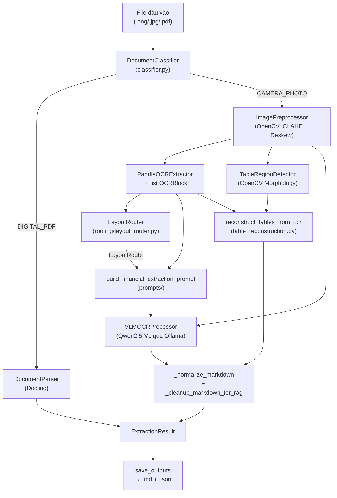
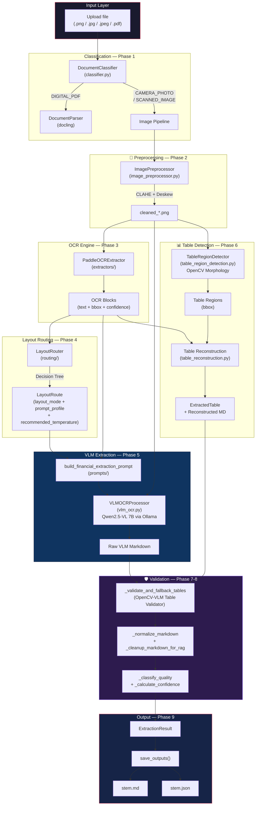

# 📄 OCR4RAG — Ingestion Pipeline

> **Module chuyển đổi tài liệu thô (ảnh chụp, ảnh scan, PDF) thành Markdown có cấu trúc, sẵn sàng nạp vào hệ thống RAG.**
>
> ⚠️ Project này **CHỈ LÀM OCR** — chuyển file đầu vào thành `.md` + `.json`. Không có Retrieval, không có Generation.

---

## 📐 Kiến trúc tổng quan

### Sơ đồ luồng dữ liệu (End-to-End)



### Sơ đồ chi tiết theo Phase (có subgraph)



---

## 📁 Cấu trúc thư mục

```
src/ingestion/
├── pipeline.py                    # Orchestrator chính — điều phối toàn bộ luồng (633 dòng)
├── classifier.py                  # Phân loại đầu vào (PDF / Scan / Camera)
├── document_parser.py             # Docling PDF parser (Happy Path)
├── image_preprocessor.py          # Tiền xử lý ảnh (CLAHE + Deskew bằng OpenCV)
├── vlm_ocr.py                     # Gọi Qwen2.5-VL qua Ollama (LangChain ChatOllama)
├── table_region_detection.py      # Phát hiện vùng bảng bằng OpenCV Morphology
├── table_reconstruction.py        # Dựng lại cấu trúc bảng từ OCR bbox (657 dòng)
│
├── extractors/                    # OCR Engines
│   └── paddle_ocr_extractor.py    # PaddleOCR 2.x/3.x wrapper (lazy-load, auto-fallback)
│
├── prompts/                       # Prompt Engineering
│   ├── __init__.py
│   └── vlm_prompts.py             # Language-agnostic VLM prompts (4 profile)
│
├── routing/                       # Layout Intelligence
│   ├── __init__.py
│   └── layout_router.py           # Auto-route dựa trên OCR signal + Dynamic Temperature
│
└── schemas/                       # Data Models
    ├── __init__.py
    └── extraction_result.py       # OCRBlock, ExtractedTable, ConfidenceReport, ExtractionResult
```

---

## 🔄 9 Phase xử lý chi tiết

### Phase 1: Classification

```
File → classifier.py → InputType
```

**Class:** `DocumentClassifier` — Phân loại file đầu vào dựa trên MIME type.

| InputType       | Mô tả                          | Luồng xử lý               |
| --------------- | ------------------------------ | -------------------------- |
| `DIGITAL_PDF`   | File PDF gốc (có text layer)   | → Docling parser           |
| `SCANNED_IMAGE` | Ảnh scan phẳng, sắc nét        | → Image Pipeline (VLM)     |
| `CAMERA_PHOTO`  | Ảnh chụp camera (méo, mờ, lóa) | → Image Pipeline (VLM)     |

> **Lưu ý:** Hiện tại toàn bộ file ảnh đều bị ép qua `CAMERA_PHOTO` để tận dụng sức mạnh VLM trong việc khôi phục dấu và dựng bảng.

---

### Phase 2: Preprocessing

```
Ảnh gốc → ImagePreprocessor → cleaned_*.png
```

**Class:** `ImagePreprocessor` — Hai thao tác tăng cường nhẹ bằng OpenCV:

1. **Auto-brightness (CLAHE):** Phát hiện ảnh tối (`L_avg < 110`) → cân bằng sáng có chọn lọc qua không gian màu LAB. Chỉ vùng tối mới được làm sáng, vùng đã sáng giữ nguyên.
2. **Deskew:** Phát hiện góc nghiêng bằng `minAreaRect` trên mask nhị phân → xoay thẳng ảnh. Bỏ qua nếu góc < 0.5°.

**Triết lý:** Tuyệt đối không dùng Blur/Denoise/Sharpen — giữ nguyên pixel gốc cho VLM và PaddleOCR phân tích.

---

### Phase 3: OCR Extraction

```
cleaned_*.png → PaddleOCRExtractor → list[OCRBlock]
```

**Class:** `PaddleOCRExtractor` — Wrapper quanh PaddleOCR:

| Tính năng | Chi tiết |
|-----------|----------|
| **Lazy-load** | Chỉ khởi tạo engine khi cần, tránh tốn RAM khi import |
| **Auto-fallback** | PaddleOCR 3.x (`predict()`) → 2.x (`ocr()`) tự động |
| **Multi-language** | Map `vi/en/ch/ja/ko` sang PaddleOCR lang hợp lệ |
| **Output chuẩn hóa** | Trả `list[OCRBlock]` thống nhất bất kể API version |
| **Windows fix** | Tắt oneDNN/PIR để tránh lỗi trên Windows CPU |

**Vai trò:** PaddleOCR **không phải** là công cụ đọc chữ cuối cùng. Nó chỉ cung cấp **sườn ký tự + tọa độ bbox** để:
- VLM dùng làm "bản nháp" chống ảo giác
- LayoutRouter phân tích cấu trúc tài liệu
- TableReconstruction dựng lại bảng từ vị trí

---

### Phase 4: Layout Analysis

```
OCR Blocks → LayoutRouter → LayoutRoute
```

**Class:** `LayoutRouter` — Decision Tree phân tích thống kê OCR blocks:

| Thứ tự | Điều kiện | Layout Mode | Prompt Profile | Temperature |
|--------|-----------|-------------|----------------|-------------|
| 1 (Critical) | `total_blocks == 0` hoặc `avg_conf < 0.35` | `critical_fail` | `MIXED_LAYOUT` | 0.0 |
| 2 (Quality) | `avg_conf < 0.65` | `noisy_scan` | `ANTI_HALLUCINATION_MIXED` | 0.0 |
| 3 (Layout) | `marker_ratio > 0.15` & `aligned_ratio > 0.4` | `table_rich` | `TABLE_PRIORITY` | 0.0 |
| 4 (Layout) | `numeric_ratio < 0.1` & `long_text_ratio > 0.7` | `clean_text` | `TEXT_PRIORITY` | 0.2 |
| 5 (Default) | Không thuộc các trường hợp trên | `mixed_layout` | `MIXED_LAYOUT` | 0.1 |

**Metrics được tính:**

| Metric | Ý nghĩa |
|--------|---------|
| `avg_ocr_confidence` | Độ tin cậy trung bình OCR |
| `numeric_ratio` | Tỷ lệ block chứa số |
| `money_ratio` | Tỷ lệ block giống số tiền |
| `marker_ratio` | Tỷ lệ block chứa từ khóa bảng (STT, Total, VAT...) |
| `aligned_ratio` | Tỷ lệ block nằm thẳng hàng (dấu hiệu bảng) |
| `density_ratio` | Mật độ ký tự trên diện tích ảnh |
| `abbreviation_ratio` | Tỷ lệ từ viết hoa hoàn toàn (mã y tế, kỹ thuật) |

**Dynamic Temperature:** Temperature VLM được điều chỉnh theo layout. Nếu `abbreviation_ratio > 0.35`, ép `temperature = 0.0` bất kể layout.

---

### Phase 5: VLM Extraction (Core)

```
cleaned_*.png + OCR Blocks + Prompt Profile
    → build_financial_extraction_prompt()
    → VLMOCRProcessor (Qwen2.5-VL 7B)
    → Raw Markdown
```

**Class:** `VLMOCRProcessor` — Gọi Qwen2.5-VL qua Ollama (LangChain `ChatOllama`).

- Ảnh encode Base64 → gửi kèm prompt qua `HumanMessage` (multi-modal).
- Tự động convert WebP → JPEG (Ollama không hỗ trợ tốt WebP).
- Dynamic Temperature: tái sử dụng VLM instance nếu cùng temperature.

**Prompt Engineering** (`vlm_prompts.py`) — 4 lớp bảo vệ:

| Lớp | Nội dung |
|-----|---------|
| **Core Instructions** | Output Markdown thuần, không JSON, không code block |
| **Anti-Hallucination** | Ép dùng OCR text làm sườn, chỉ được thêm dấu, CẤM thay thế chữ |
| **Profile Rules** | 4 profile: `TEXT_PRIORITY`, `TABLE_PRIORITY`, `ANTI_HALLUCINATION_MIXED`, `MIXED_LAYOUT` |
| **OCR Context** | Danh sách OCR blocks kèm confidence score (max 300 blocks) |

**Đây là "bộ não" chính của pipeline**, chịu trách nhiệm sinh Markdown cuối cùng.

---

### Phase 6: Table Detection & Reconstruction (Song song với Phase 5)

```
cleaned_*.png → TableRegionDetector → Table Regions (bbox)
OCR Blocks + Table Regions → reconstruct_tables_from_ocr() → ExtractedTable[]
```

#### 6a. `TableRegionDetector` — Phát hiện vùng bảng

Sử dụng OpenCV Morphology:

1. Nhị phân hóa ảnh (Adaptive Threshold)
2. Trích xuất đường kẻ ngang/dọc bằng Erosion + Dilation
3. Gộp thành lưới (grid), tìm contour bao quanh
4. **Fallback:** Canny Edge nếu lưới quá yếu
5. Merge overlapping regions (IoU ≥ 0.25)

Output: `list[TableRegion]` — bbox + confidence score.

#### 6b. `table_reconstruction.py` — Dựng lại bảng từ OCR bbox

Thuật toán heuristic:

1. **Group rows:** Gom OCR blocks cùng dòng dựa trên vertical overlap + center_y
2. **Extract columns:** Tìm anchor cột từ hàng có nhiều ô nhất
3. **Snap to grid:** Gán mỗi block vào cột neo gần nhất
4. **Quality scoring:** Chấm điểm dựa trên snap distance, empty cell ratio, OCR confidence, sanity check
5. **Fallback:** Nếu confidence < 0.7 → trả linear text thay vì bảng lỗi

Đây là cơ chế **backup** — pipeline ưu tiên tin tưởng VLM, chỉ dùng reconstructed table khi VLM rỗng hoặc bị lỗi.

---

### Phase 7: Normalization & Cleanup

```
Raw VLM Markdown + Reconstructed Tables
    → _validate_and_fallback_tables()    (OpenCV-VLM Table Validator)
    → _normalize_markdown()
    → _cleanup_markdown_for_rag()
```

**OpenCV-VLM Table Validator:** So sánh cấu trúc bảng VLM vs OpenCV:
- VLM không sinh bảng nhưng OpenCV có → append bảng OpenCV
- VLM bị thiếu/thừa cột (lệch ≥ 2 so với OpenCV) → swap bằng bảng OpenCV
- VLM bị broken pipe (số cột không đồng nhất giữa các hàng) → swap

**Normalize Markdown:** Loại JSON/code fence → fallback từ tables → fallback từ OCR blocks.

**Cleanup for RAG:**
- Chèn dòng trống trước bảng (table spacing)
- Ép xuống dòng cứng cho text thường (`"  "` hard line breaks)
- Khâu dấu `|` bị rớt dòng (stitch broken pipes)
- Loại bỏ dòng trùng lặp
- Rebuild từ OCR blocks nếu markdown quá nhiễu (bullet_ratio ≥ 70% hoặc short_ratio ≥ 85%)

---

### Phase 8: Validation & Scoring

```
ExtractionResult → _classify_quality() → quality_class, quality_score
ExtractionResult → _calculate_confidence() → ConfidenceReport
ExtractionResult → _requires_human_review() → bool
```

**Quality Classification:**

| Quality Class | Điều kiện | Hành động |
|---------------|-----------|-----------|
| `critical_fail` | OCR conf < 0.35 hoặc output < 30 chars | Quét lại hoặc review thủ công |
| `noisy_scan` | OCR conf < 0.65 hoặc có uncertain tokens | Preprocess nhẹ, giữ OCR gốc |
| `table_rich` | Có bảng, ít text | Ưu tiên bbox reconstruction + VLM normalize |
| `mixed_layout` | Vừa text vừa bảng | Tách text/table, VLM ráp cấu trúc |
| `clean_text` | Text thuần, ít số | OCR + VLM nhẹ |

**Confidence Report:**
- `ocr_confidence` (35%) — Trung bình confidence PaddleOCR
- `layout_confidence` (35%) — Dựa trên độ dài markdown + sanitize warnings
- `table_confidence` (30%) — Dựa trên có bảng chuẩn hay không
- `overall` = weighted sum

**Human Review Flag:** Bật nếu quality_class = critical_fail, confidence < threshold (0.75), document_type = unknown, hoặc có sanitize warnings.

---

### Phase 9: Output

```
ExtractionResult → save_outputs()
    → data/processed/{stem}.md    (Markdown cho RAG)
    → data/processed/{stem}.json  (Full metadata)
```

---

## 📊 Data Models (`schemas/extraction_result.py`)

| Class | Các trường chính | Mô tả |
|-------|-----------------|-------|
| `OCRBlock` | `text`, `confidence`, `bbox`, `language` | Một block text do PaddleOCR phát hiện |
| `ExtractedTable` | `name`, `columns`, `rows` | Bảng đã trích xuất/dựng lại |
| `ConfidenceReport` | `ocr_confidence`, `layout_confidence`, `table_confidence`, `overall` | Điểm tin cậy tổng hợp |
| `ExtractionResult` | `source_file`, `markdown`, `tables`, `raw_ocr`, `quality_class`, `quality_score`, `confidence`, `requires_human_review`, `metadata` | **Output cuối cùng** — chứa tất cả |

---

## 🛠️ Tech Stack

| Thành phần | Công nghệ | Vai trò |
|------------|-----------|---------|
| OCR Engine | PaddleOCR 2.x/3.x | Trích xuất text + bbox từ ảnh |
| Vision LLM | Qwen2.5-VL 7B (via Ollama) | Sinh Markdown từ ảnh + OCR context |
| Image Processing | OpenCV | CLAHE, Deskew, Table Region Detection |
| PDF Parser | Docling | Parse PDF digital có text layer |
| LLM Framework | LangChain (ChatOllama, HumanMessage) | Giao tiếp với Ollama |
| Image Format | Pillow (PIL) | Convert WebP → JPEG |
| Config | PyYAML | Đọc setting.yaml + logging.yaml |

---

## ⚙️ Cấu hình (`config/setting.yaml`)

```yaml
llm:
  ollama:
    base_url: "http://localhost:11434"
    model: "qwen2.5:7b"         # LLM text thường
    vlm_model: "qwen2.5vl:7b"   # Vision Language Model
    embed_model: "nomic-embed-text"

# Cấu hình OCR (đọc qua settings.get())
ingestion:
  ocr:
    enabled: true
    languages: ["vi", "en"]
    use_gpu: false
```

---

## 🧪 Testing

### Test đơn lẻ

```bash
python scratch/test_markdown_ocr.py "data/raw/ocr_eval/bad_cases/anh_chup_dien_thoai_meo.png"
```

### Test hàng loạt (batch)

```bash
python scratch/test_batch.py
```

Output lưu tại:
- `data/processed/{tên_ảnh}.md` — Markdown
- `data/processed/{tên_ảnh}.json` — JSON metadata

### Benchmark (evaluation/)

```bash
python evaluation/ocr/scripts/run_ocr_eval.py    # Chạy OCR trên tập test
python evaluation/ocr/scripts/score_only.py       # Tính CER/WER/Sim/TokenSim
```

Kết quả benchmark trên 50 tài liệu `custom_doc_anchor_ai`:
- **Number F1:** 90.22%
- **Content Score:** 83.58%
- **Similarity:** 86.06%

---

## 💡 Triết lý thiết kế

1. **VLM-First:** Qwen2.5-VL 7B là "bộ não" chính. PaddleOCR chỉ là "mắt kính" cung cấp sườn text + tọa độ.
2. **Anti-Hallucination:** VLM bị ép phải dựa trên sườn text PaddleOCR, chỉ được thêm dấu, KHÔNG được thay thế chữ hoặc bịa số.
3. **Language-Agnostic:** Toàn bộ prompt bằng tiếng Anh trung lập, không hardcode ngôn ngữ cụ thể. Hỗ trợ đa ngôn ngữ tự nhiên.
4. **Minimal Preprocessing:** Chỉ CLAHE (ảnh tối) + Deskew (ảnh nghiêng). Tuyệt đối không denoise/sharpen/contrast — giữ nguyên pixel gốc.
5. **Graceful Fallback:** VLM rỗng → Reconstructed Table (OpenCV) → OCR linear text → Raw VLM response.
6. **Code-level Fix > Prompt Fix:** Lỗi format Markdown (broken tables, collapsed paragraphs) được sửa bằng thuật toán Python, không ép vào prompt.
7. **Dynamic Temperature:** Temperature VLM được điều chỉnh tự động theo đặc thù layout (bảng biểu = 0.0, text thuần = 0.2).
